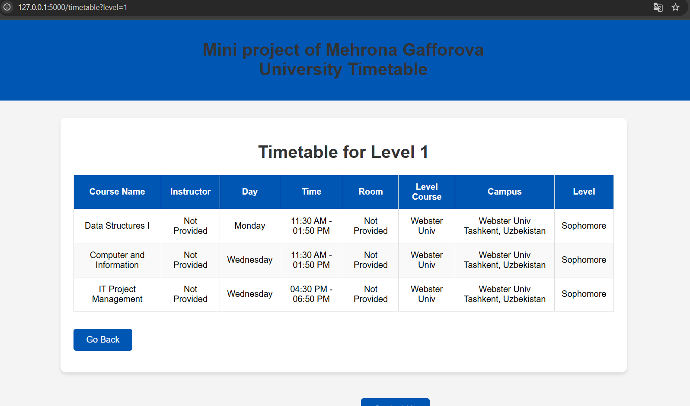
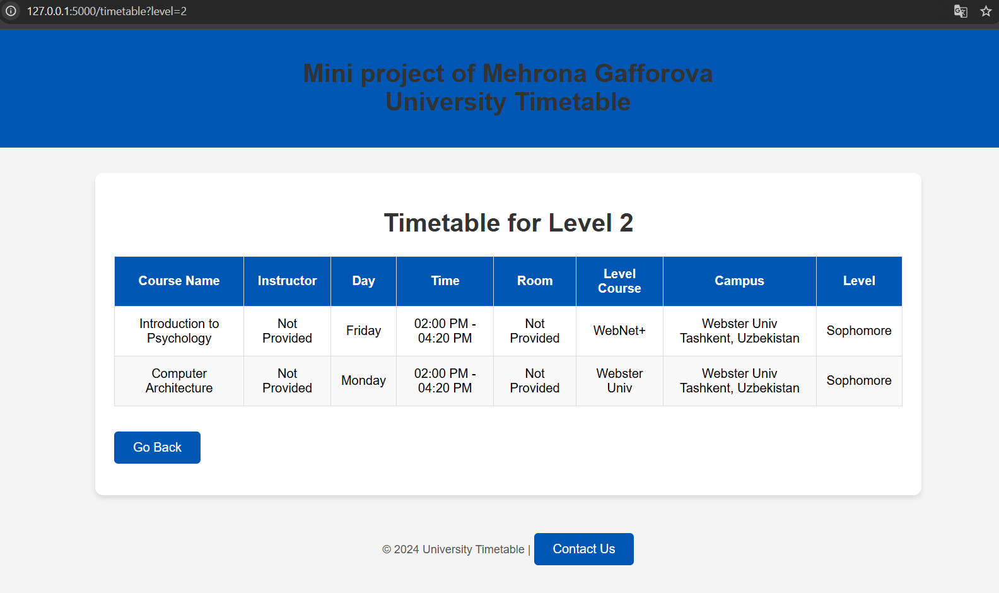

# University Timetable Portal

This project is a Flask-based web application for Webster University in Tashkent. The portal allows students to view their timetable by selecting their course level. It uses a PostgreSQL database for storing and retrieving timetable data and runs in a Docker container for easy deployment.

---

## **Features**

- Displays timetables dynamically based on course level.
- Fully integrated with a PostgreSQL database for data storage.
- Dockerized database for ease of setup and management.
- Clean, user-friendly interface designed with HTML and CSS.

---

## **Project Components**

### **1. Flask App (`app.py`)**
The Flask application handles requests, connects to the PostgreSQL database, and renders the HTML templates.

- **Key Routes**:
  - `/`: Displays the homepage where users can select their course level.
  - `/timetable`: Fetches the timetable data for the selected course level from the database and displays it.

- **Error Handling**:
  - Ensures a proper response if no data is available for the selected level.
  - Handles database connection errors gracefully.

### **2. PostgreSQL Database**
The database is used to store timetable and student data.

- **Tables**:
  - `Timetable`: Contains course details such as course name, instructor, time, room, and level.
  - `Students`: Stores student information such as name, classification, major, and advisor.

### **3. HTML Templates**
- **`index.html`**: Homepage where users can select their course level.
- **`timetable.html`**: Displays the timetable for the selected course level. If no data is found, an appropriate message is shown.

### **4. Docker**
- Docker is used to set up and run the PostgreSQL database in a container, simplifying the installation and configuration process.

---

## **Installation Guide**

### **Prerequisites**
Before you begin, ensure the following are installed:
- Python 3.7+  
- Docker  
- pip (Python package manager)  

---

### **Steps**

#### **1. Clone the Repository**
```bash
git clone <repository-link>
cd <project-directory>
```

#### **2. Set Up the PostgreSQL Database**
Pull and run the PostgreSQL Docker image:
```bash
docker pull postgres:latest
docker run --name mehrona_university-db -e POSTGRES_USER=Mehrona -e POSTGRES_PASSWORD=Nehrona_Gafforova -d -p 5432:5432 postgres:latest
```

#### **3. Verify the Docker Container**
Ensure the database container is running:
```bash
docker ps
```

#### **4. Create the Required Tables**
Access the PostgreSQL container and set up the database schema:
```bash
docker exec -it mehrona_university-db psql -U Mehrona
```

Run the following SQL commands:
```sql
CREATE TABLE Timetable (
    course_id SERIAL PRIMARY KEY,
    course_name VARCHAR(255),
    instructor VARCHAR(255),
    day VARCHAR(50),
    time VARCHAR(50),
    room VARCHAR(50),
    building VARCHAR(255),
    campus VARCHAR(255),
    level_course VARCHAR(50),
    level INT
);

CREATE TABLE Students (
    student_id SERIAL PRIMARY KEY,
    name VARCHAR(255),
    classification VARCHAR(50),
    major VARCHAR(255),
    advisor VARCHAR(255)
);

INSERT INTO Timetable (course_name, instructor, day, time, room, building, campus, level_course, level) VALUES
('Data Structures I', 'Not Provided', 'Monday', '11:30 AM - 01:50 PM', 'Not Provided', 'Webster Univ', 'Webster Univ Tashkent, Uzbekistan', 'Sophomore', 1),
('Computer and Information', 'Not Provided', 'Wednesday', '11:30 AM - 01:50 PM', 'Not Provided', 'Webster Univ', 'Webster Univ Tashkent, Uzbekistan', 'Sophomore', 1),
('IT Project Management', 'Not Provided', 'Wednesday', '04:30 PM - 06:50 PM', 'Not Provided', 'Webster Univ', 'Webster Univ Tashkent, Uzbekistan', 'Sophomore', 1),
('Introduction to Psychology', 'Not Provided', 'Friday', '02:00 PM - 04:20 PM', 'Not Provided', 'WebNet+', 'Webster Univ Tashkent, Uzbekistan', 'Sophomore', 2),
('Computer Architecture', 'Not Provided', 'Monday', '02:00 PM - 04:20 PM', 'Not Provided', 'Webster Univ', 'Webster Univ Tashkent, Uzbekistan', 'Sophomore', 2),
('Introduction to Political Theory', 'Not Provided', 'Thursday', '11:30 AM - 01:50 PM', 'Not Provided', 'WebNet+', 'Webster Univ Tashkent, Uzbekistan', 'Sophomore', 3);

INSERT INTO Students (name, classification, major, advisor) VALUES
('Mehrona Gafforova', 'Junior', 'COSC - Computer Science', 'Abdumanov, Shoxrux');
```

#### **5. Set Up the Python Environment**
Create and activate a virtual environment:
```bash
python -m venv venv
source venv/bin/activate  # For Windows: venv\Scripts\activate
```

Install required dependencies:
```bash
pip install flask pg8000
```

#### **6. Run the Flask Application**
Start the application:
```bash
python app.py
```

Access the app in your browser at:
```
http://127.0.0.1:5000/
```

---

## **How It Works**

1. **Homepage**: Users select their course level (1, 2, or 3).
2. **Timetable Page**: The app fetches timetable data from the PostgreSQL database based on the selected level and displays it.
3. **Error Handling**: If no data exists for the selected level, a message informs the user.

---

## **Project File Structure**
```
project/
│
├── app.py                # Flask application file
├── templates
├── ├──index.html            # Homepage template
├── ├──timetable.html        # Timetable display template
├── venv/                 # Virtual environment directory
├── requirements.txt      # Python dependencies (if needed)
├── README.md             # Project documentation
└── ...
```

---

## **Technologies Used**

- **Backend**: Flask (Python)
- **Database**: PostgreSQL
- **Frontend**: HTML, CSS
- **Containerization**: Docker


---

## **Author**

- Mehrona Gafforova  
  Webster University in Tashkent  




